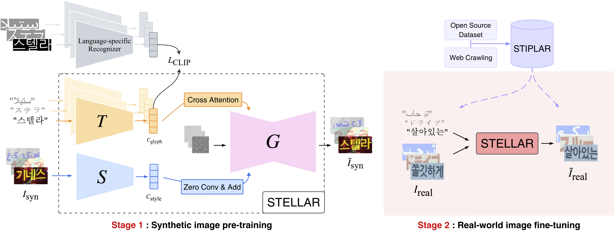

# STELLAR: Scene Text Editor for Low-resource LAnguage and Real-world data

> **Authors**: Yongdeuk Seo, Hyun-seok Min, Sungchul Choi

[](https://arxiv.org/abs/2511.09977) [](https://yongchoooon.github.io/stellar/) [](https://huggingface.co/datasets/yongchoooon/STIPLAR)

## 🎉 Congratulations!
This repository is the official implementation of the oral paper accepted to the AIBSD workshop at AAAI 2026: [Official Workshop Page](https://aibsdworkshop.github.io/2026/index.html)



## Install
```bash
conda create -n stellar python=3.10.12
conda activate stellar
pip install "torch==2.1.2" "torchvision==0.16.2" --index-url https://download.pytorch.org/whl/cu121
pip install -r requirements.txt
```

## Checkpoints Preparation
Here's the restructured text with different wording: [Link_1](https://huggingface.co/datasets/yongchoooon/STIPLAR/tree/main/weights) and [Link_2](https://huggingface.co/stable-diffusion-v1-5/stable-diffusion-v1-5). You can download the model checkpoints for your desired language(ko: Korean, ar: Arabic, jp: Japanese). Arrange the directory structure as shown below:
```bash
stellar/
├── weights/
│   ├── model_stage1_ko.pth
│   ├── model_stage1_ar.pth
│   ├── model_stage1_jp.pth
│   ├── model_stage2_ko.pth
│   ├── model_stage2_ar.pth
│   ├── model_stage2_jp.pth               # weight of style encoder and unet 
│   ├── text_encoder_ko.pth
│   ├── text_encoder_ar.pth
│   ├── text_encoder_jp.pth               # weight of pretrained glyph encoder
│   ├── style_encoder_ko.pth
│   ├── style_encoder_ar.pth
│   ├── style_encoder_jp.pth              # weight of pretrained style encoder
│   ├── style_encoder_ko.ckpt
│   ├── style_encoder_ar.ckpt
│   ├── style_encoder_jp.ckpt             # checkpoint of pretrained style encoder, projection layer and heads (for evaluation with TAS)
│   ├── vgg19.pth                         # vgg weight
│   └── sd/                               # pretrained weight of stable-diffusion-v1-5
│       ├── vae/
│       ├── unet/
│       └── scheduler/ 
├── README.md
├── ...
```

## Inference
### Data Preparation
The file structure of inference data should be set as the *example/*:  
```bash
stellar/
├── example/
│   ├── i_s/                # source cropped text images
│   ├── i_s.txt             # filename and text label of source images in i_s/
│   └── i_t.txt             # filename and text label of target images
```

### Running Inference with Config Files
Create a `yaml` file with your desired content in the `configs_inference` folder, then run `inference_by_config.py`. An example is shown below:
```bash
python inference_by_config.py --config cfg_infer_ko_stage2
```

## Training
### Data Preparation: Stage 1
The synthetic data used for Stage 1 training can be generated in the `datagen` folder. This is a modified version of the code from [SRNet-Datagen](https://github.com/youdao-ai/SRNet-Datagen). Arrange the directory structure as shown below:
```bash
Syn_data/
├── fonts/
│   ├── NanumGothic.ttf/              
│   └── .../  
├── train/
│   ├── train-50k-1/                    
│   ├── train-50k-2/            
│   ├── train-50k-3/              
│   └── train-50k-4/                     
│       ├── i_s/
│       ├── mask_s/
│       ├── i_s.txt
│       ├── t_f/
│       ├── mask_t/
│       ├── i_t.txt
│       ├── t_t/
│       ├── t_b/
│       └── font.txt/ 
└── eval/
    └── eval-1k/
```

### Data Preparation: Stage 2
For Stage 2 training, we utilize `STIPLAR`, our newly proposed scene text image pairs of low-resource language and real-world data. The dataset for each language can be downloaded from [Link](https://huggingface.co/datasets/annms-stellar/stiplar).

### Text Style Encoder Pretraining
Create a `yaml` file with your desired settings in the `configs` folder, then run the `pretrain.py` file as follows. An example is shown below:
```bash
cd prestyle/
python pretrain.py --config cfg_pretrain_style_ko
```

### Language-Adaptive Glyph Encoder Pretraining
Create a `yaml` file with your desired settings in the `configs` folder, then run the `pretrain.py` file as follows. An example is shown below:
```bash
cd preglyph/
python pretrain.py --config cfg_pretrain_label_ko
```

### Diffusion Generator Training
Create a `yaml` file with your desired settings in the `configs` folder, then run the `train.py` file as follows. An example is shown below:
```bash
cd stellar/
# Stage 1
python train.py --config cfg_train_ko_stage1
# Stage 2
python train.py --config cfg_train_ko_stage2
```

## Evaluation
### Data Preparation
Download the STIPLAR-eval dataset from [Link](https://huggingface.co/datasets/yongchoooon/STIPLAR/tree/main/STIPLAR-eval) and unzip the files. This is a newly re-numbered version that combines the `eval-crawling` folder and the `eval-mlt2019` folder from the `STIPILAR` dataset.
```bash
├── stellar/
│   ├── STIPLAR-ko-eval/
│   ├── STIPLAR-ar-eval/
│   └── STIPLAR-jp-eval/
│       ├── i_s/
│       ├── t_f/
│       └── i_full/
```

### Image Quality and Visual Style Preservation w/ TAS
`SSIM`, `PSNR`, `MSE` and `FID` are employed to assess the image quality of the editing results, following [qqqyd/MOSTEL](https://github.com/qqqyd/MOSTEL). Text Appearance Similarity (`TAS`) is our newly proposed metric that measures the visual style preservation of the edited results. To conduct the evaluation, configure a `yaml` file with your desired parameters in the `configs` folder and execute the `evaluation.py` script.
```bash
cd evaluation/
python evaluation.py --configs cfg_eval_STIPLAR_ko --lang ko
```

### Text Recognition Accuracy
Text Recognition Accuracy is evaluated using `Rec.Acc` and `NED` metrics. For Korean and Japanese, the PPOCRv4 model is utilized, while for Arabic, the Google Cloud Vision API is employed for assessment. To use the Google Cloud Vision API, the credential file must be placed in the appropriate folder. To perform the evaluation, create a `yaml` file in the `configs` folder and run the script as shown in the example below.
```bash
cd evaluation/
# For Korean, Japanese
python evaluation_ocr.py --config cfg_STIPLAR_ko --lang ko
python evaluation_ocr.py --config cfg_STIPLAR_jp --lang jp
# For Arabic
python evaluation_ocr_ar.py --config cfg_STIPLAR_ar --lang ar --credentials /path/to/your/credentials.json
```

## Related Resources
Special thanks to these great projects [weichaozeng/TextCtrl](https://github.com/weichaozeng/TextCtrl).

## Citation

```tex
@misc{seo2025stellarscenetexteditor,
      title={STELLAR: Scene Text Editor for Low-Resource Languages and Real-World Data}, 
      author={Yongdeuk Seo and Hyun-seok Min and Sungchul Choi},
      year={2025},
      eprint={2511.09977},
      archivePrefix={arXiv},
      primaryClass={cs.CV},
      url={https://arxiv.org/abs/2511.09977}, 
}
```
