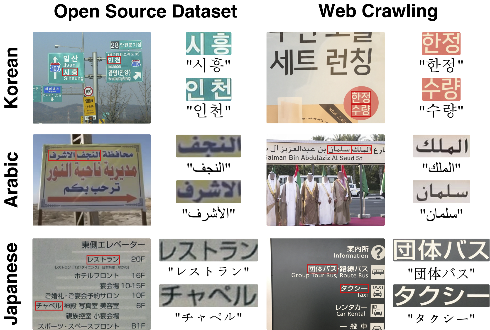

# STIPLAR: Scene Text Image Pairs of Low-resource lAnguage and Real-world data
- STIPLAR is a real-world scene text image dataset containing Korean, Arabic, and Japanese text image pairs collected from MLT-2019 and web sources, designed for fine-tuning STELLAR on low-resource languages.

<div align="center">

</div>

## Dataset
For Stage 2 training, we utilize `STIPLAR`, our newly proposed scene text image pairs of low-resource language and real-world data. The dataset for each language can be downloaded from [Link](https://huggingface.co/datasets/yongchoooon/STIPLAR).

## Statistics
<details>
<summary><strong>Version 1 (2025.08.06)</strong></summary>

| Lang.    | Type            | Train Open | Train Crawl | Train Total | Eval Open | Eval Crawl | Eval Total |
|----------|-----------------|------------|-------------|-------------|-----------|------------|------------|
| Korean   | Full image      | 269        | 317         | 586         | 68        | 80         | 148        |
| Korean   | Text image pair | 1456       | 6229        | 7685        | 362       | 1717       | 2079       |
| Arabic   | Full image      | 252        | 56          | 308         | 64        | 15         | 79         |
| Arabic   | Text image pair | 1879       | 3460        | 5339        | 450       | 531        | 981        |
| Japanese | Full image      | 97         | 252         | 349         | 25        | 63         | 88         |
| Japanese | Text image pair | 356        | 1282       | 1638       | 97        | 288       | 385       |

- `Train Open`, `Eval Open`: Images from Open-source dataset

- `Train Crawl`, `Eval Crawl`: Images from web crawling.

</details>

<details>
<summary><strong>Version 2 (2025.08.15)</strong></summary>

- In the Arabic `Train Crawl`, 1 Full image and 3 Text image pairs have been removed.

| Lang.    | Type            | Train Open | Train Crawl | Train Total | Eval Open | Eval Crawl | Eval Total |
|----------|-----------------|------------|-------------|-------------|-----------|------------|------------|
| Korean   | Full image      | 269        | 317         | 586         | 68        | 80         | 148        |
| Korean   | Text image pair | 1456       | 6229        | 7685        | 362       | 1717       | 2079       |
| Arabic   | Full image      | 252        | **55**          | **307**         | 64        | 15         | 79         |
| Arabic   | Text image pair | 1879       | **3457**        | **5336**        | 450       | 531        | 981        |
| Japanese | Full image      | 97         | 252         | 349         | 25        | 63         | 88         |
| Japanese | Text image pair | 356        | 1282       | 1638       | 97        | 288       | 385       |

- `Train Open`, `Eval Open`: Images from Open-source dataset

- `Train Crawl`, `Eval Crawl`: Images from web crawling.

</details>

<details>
<summary><strong>Version 3 (2025.08.24)</strong></summary>

- In the Arabic `Train Open`, 1 Full image and 1 Text image pairs have been removed.

| Lang.    | Type            | Train Open | Train Crawl | Train Total | Eval Open | Eval Crawl | Eval Total |
|----------|-----------------|------------|-------------|-------------|-----------|------------|------------|
| Korean   | Full image      | 269        | 317         | 586         | 68        | 80         | 148        |
| Korean   | Text image pair | 1456       | 6229        | 7685        | 362       | 1717       | 2079       |
| Arabic   | Full image      | **251**        | 55          | **306**         | 64        | 15         | 79         |
| Arabic   | Text image pair | **1878**       | 3457        | **5335**        | 450       | 531        | 981        |
| Japanese | Full image      | 97         | 252         | 349         | 25        | 63         | 88         |
| Japanese | Text image pair | 356        | 1282       | 1638       | 97        | 288       | 385       |

- `Train Open`, `Eval Open`: Images from Open-source dataset

- `Train Crawl`, `Eval Crawl`: Images from web crawling.

</details>


## Evaluation
Download the STIPLAR-eval dataset from [Link](https://huggingface.co/datasets/yongchoooon/STIPLAR/tree/main/STIPLAR-eval) and unzip the files. This is a newly re-numbered version that combines the `eval-crawling` folder and the `eval-mlt2019` folder from the `STIPILAR` dataset.
```bash
├── stellar/
│   ├── STIPLAR-ko-eval/
│   ├── STIPLAR-ar-eval/
│   └── STIPLAR-jp-eval/
│       ├── i_s/
│       ├── t_f/
│       └── i_full/
```
